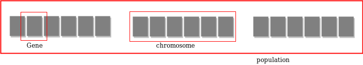

# 谈TSP问题

## 一、TSP概述

### 1.TSP

TSP问题（Traveling Salesman Problem）:旅行商问题，又译为旅行推销员问题、货郎担问题，是数学领域中著名问题之一。假设有一个旅行商人要拜访n个城市，他必须选择所要走的路径，路径的限制是每个城市只能拜访一次，而且最后要回到原来出发的城市。路径的选择目标是要求得的路径路程为所有路径之中的最小值。

### 2.数学表达TODO：

### 3.TSP变种问题：

- 最小哈密顿链的问题：起点和终点不同；
- 非对称旅行商问题（asymmetric TSP）：距离矩阵非对称的旅行商问题；
- 多人旅行商问题（muti-person TSP）：由多人完成旅行的旅行商问题；
- 多目标旅行商问题（multi-objective TSP）；
- 依次排序问题（Sequence ordering problem ，SOP）：这类问题是非对称旅行商问题，在给定一系列顶点和距离矩阵下，寻找最短从顶点 1 到顶点 n 哈密顿链，同时满足限制：某些顶点要在一些顶点之前被连接。
- 载货量受限制的车辆路径问题（Capacitated vehicle routing problem，CVRP）：给定 n-1 个顶点和一个仓库，已知顶点和顶点、仓库和顶点的距离，卡车载货量受限制，卡车每次在部分顶点和仓库之间往返，寻求一条经过所有顶点的最短路线。
  

`TSP问题是一个NP完全问题，证明：1、TSP是一个NP问题；2、TSP问题可以由3-SAT问题规约得到`

`3-SAT问题是第一个被证明的NP完全问题`

`**P类问题**：可以在多项式时间内解决的问题。`

`**NP类问题**：解可以在多项式时间内验证的问题。`

`**NP完全问题**：既属于NP类，又是NP类中最难的问题。`

`**NP困难问题**：至少与NP类问题一样难的问题。`

### 4.时间复杂度

- **暴力搜索**：枚举所有可能的城市访问顺序，并计算每个顺序的路径长度，以找到最短路径。**时间复杂度O(n!)**

- **动态规划算法**（如Held-Karp算法）可以在一定程度上优化TSP的求解。该算法使用子集和动态规划表来记录和计算路径长度。**时间复杂度：O(n^2 * 2^n)**

对于大规模实例，通常使用启发式算法或近似算法来获得接近最优解的解。

- **贪心算法（Greedy Algorithm）**

  - **最近邻算法**：从一个起始城市开始，每次访问距离最近的未访问城市。**时间复杂度：O(n^2)**

  - **最邻近插入法**：选择最短边，确保不会形成子循环，直到形成一个完整的环。**时间复杂度：O(n^2 log n)**

- **遗传算法、粒子群算法、蚁群算法、模拟退火算法等**优化算法，时间复杂度取决于具体实现和参数设置，一般为**多项式时间**。

## 二、贪心算法

​	贪心算法，又名贪婪算法，是一种常用的求解最优化问题的简单、迅速的算法。**贪心算法总是做出在当前看来最好的选择，它所做的每一个在当前状态下某种意义上是最好的选择即贪心选择，并希望通过每次所作的贪心选择导致最终得到问题最优解。**必须注意的是，贪心算法不是对所有问题都能得到整体最优解，选择的贪心策略必须具备无后效性，即某个状态以后的过程不会影响以前的状态，只与当前状态有关。

### 1.算法思路

不考虑各种可能的整体情况，省去了为找最优解要穷尽所有可能而必须耗费的大量时间。

其中贪心策略直接影响整个算法的求解质量。


### 2.贪心策略

- **最近邻算法**：从一个起始城市开始，每次访问距离最近的未访问城市。

- **最邻近插入法**：选择最短边，确保不会形成子循环，直到形成一个完整的环。
  - 其实生成0->1->0的一个回路，不断往回路之中插入点

### 3.求解情况

使用VLSI系列数据集，从小规模到大规模都有，一共102个，点数从131到744,710。


​	测试了十九组，规模点数从131到1483，其结果如下


​										**pbn423.tsp 使用最邻近插入法结果**


​										**pbn423.tsp 使用最近邻法结果**


​	测试结果可以看出，贪心算法不能得到最优解，但是可以求解到比较优秀的解，但随着点数规模的增大，其结果也在逐渐变得糟糕。对比最邻近插入法与最近邻法，在绝大多数情况下，前者的结果要优于后者。

## 三、动态规划

​	可以求得最优解，但是其时间复杂度太高，对于点数规模在40-50的数据就显得很无能为力了。

## 四、遗传算法

​	遗传算法 (GA) 是一种自适应启发式搜索算法，属于进化算法。遗传算法基于自然选择和遗传学的思想。这些算法智能地利用随机搜索，并提供历史数据，将搜索引导到解决方案空间中性能更好的区域。**它们通常用于为优化问题和搜索问题生成高质量的解决方案。**

​	**遗传算法模拟自然选择的过程**，这意味着那些能够适应环境变化的物种可以生存和繁殖并进入下一代。简而言之，它们模拟连续几代个体之间的“适者生存”来解决问题。**每一代都由一群个体组成**，每个个体代表搜索空间中的一个点和可能的解决方案。**每个个体都表示为一个字符串/整数/浮点数/位**。这个字符串类似于染色体。

参考：[遗传算法超详解（全网最详细）](https://www.cnblogs.com/LcyRegister/p/17281139.html)、[遗传算法](https://www.geeksforgeeks.org/genetic-algorithms/)、[遗传算法求解 TSP 旅行商问题机及其实现](https://blog.csdn.net/znufe_newer/article/details/107239057?ops_request_misc=%257B%2522request%255Fid%2522%253A%2522172074867016800213084802%2522%252C%2522scm%2522%253A%252220140713.130102334.pc%255Fblog.%2522%257D&request_id=172074867016800213084802&biz_id=0&utm_medium=distribute.pc_search_result.none-task-blog-2~blog~first_rank_ecpm_v1~rank_v31_ecpm-2-107239057-null-null.nonecase&utm_term=tsp&spm=1018.2226.3001.4450)、[遗传算法解决TSP问题](https://blog.csdn.net/myf_666/article/details/131146828?ops_request_misc=%257B%2522request%255Fid%2522%253A%2522171997719416800180623798%2522%252C%2522scm%2522%253A%252220140713.130102334..%2522%257D&request_id=171997719416800180623798&biz_id=0&utm_medium=distribute.pc_search_result.none-task-blog-2~all~sobaiduend~default-2-131146828-null-null.142^v100^pc_search_result_base7&utm_term=%E9%81%97%E4%BC%A0%E7%AE%97%E6%B3%95tsp&spm=1018.2226.3001.4187)

​	[1]一种改进的求解TSP问题的演化算法[↩︎](/home/ae/Desktop/文献/TSP/一种改进的求解TSP问题的演化算法_蔡之华.pdf)

### 1.遗传算法基础

遗传算法基于与种群染色体的遗传结构和行为的类比。

1. 种群中的个体竞争资源和配偶
2. 那些成功（最适合）的个体会交配，从而产生比其他个体更多的后代
3. 来自“最适合”父母的基因会在整个世代中传播，也就是说，有时父母会创造出比父母更优秀的后代。
4. 因此，每一代都更适应其环境。

整个算法可以概括为： 

```
1）随机初始化种群 p 
2）确定种群的适应度
3）直到收敛重复：
      a）从种群中选择父母
      b）交叉并产生新种群
      c）对新种群进行变异
      d）计算新种群的适应度
```


- 搜索空间

  每个个体代表给定问题的搜索空间解决方案。每个个体被编码为有限长度的组件向量（类似于染色体）。这些可变组件类似于基因。因此，染色体（个体）由多个基因（可变组件）组成。 



- 适应度

  每个个体都会被赋予一个适应度分数，该分数**表明该个体的“竞争”能力**。寻找具有最佳适应度分数（或接近最佳）的个体。 

  GA 维护 n 个个体（染色体/解决方案）的种群及其适应度得分。适应度得分较高的个体比其他个体有更多繁殖机会。选择适应度得分较高的个体，通过结合父母的染色体进行交配并产生**更好的后代**。

  平均而言，每个新一代都比前几代的个体（解决方案）拥有更多“更好的基因”。因此，每个新一代都比前几代拥有更好的**“部分解决方案”**。一旦产生的后代与之前种群产生的后代没有显著差异，种群就会收敛。

- 遗传算法的算子

  一旦创建了初始代，算法就会使用以下运算符来进化该代

  - 选择运算符：其思想是优先考虑具有良好适应度分数的个体，并允许它们将基因传递给后代。 
  - 交叉运算符：这代表个体之间的交配。使用选择运算符选择两个个体，并随机选择交叉点。然后交换这些交叉点的基因，从而创建一个全新的个体（后代）。


- 变异算子：关键思想是在后代中插入随机基因，以保持种群的多样性，避免过早收敛。


---

### 2.求解TSP问题（GT）

>  Tao, Guo, and Zbigniew Michalewicz. "Evolutionary algorithms for the TSP." *Parallel Problem Solving from Nature* 1498 (1998): 803-812.

[郭涛算法](/home/ae/Desktop/文献/TSP/Evolutionary algorithms for the Tsp.ps)在求解TSP问题上是一种十分高效的演化算法，第一个提出了一种高效的**Inver-over算子**，即遗传算子倒置的操作，有效地增加种群的多样性，扩大搜索域，防止过早产生局部最优。后续改进方向也基本上是基于GT算法改进的。

- 染色体编码方式：以TSP访问城市顺序的序列作为染色体，即：一条染色体表示一条合法路径。

​	以5个城市为例，编码为:

​						chromosome = [1, 2, 3, 4, 5]

- 适应度：衡量某一个个体优良与否的唯一标准。在求解TSP问题中，一般采取路径长度的倒数表示。

  
  $$
  f = 1/d
  $$

- 演化算子

  - 杂交算子：在一父本S1中随机选择一座城市A，在另一个父本S2中选取A的下一座城市B，在父本S1中，对A的下一座城市到B的路径进行倒序。若AB相邻则不倒序。例如：

    S1 = {1, 2, 3, 4, 5, 6, 7, 8, 9, 10, 11, 12}

    S2 = {1, 3, 5, 6, 7, 9, 2, 8, 10, 11, 4, 12}

    随机取得A = 2,则在S2中找到A的下一座城市为B = 8, 在S1中对2到8的路径进行倒序。得到子代：

    S = {1, 2, 8, 7, 6, 5, 4, 3, 9, 10, 11, 12}

  - 变异算子：在父本S中随机选取两座城市A、B，将A到B的路径进行倒序操作。例如：

    S = {1, 2, 3, 4, 5, 6, 7, 8, 9, 10, 11, 12}

    随机得到A = 3, B = 11得到变异后的个体：

    S = {1, 2, 11, 10, 9, 8, 7, 6, 5, 4, 3, 12}

- 选择策略：进行杂交或变异操作之后，产生新的个体，为了保持样本总数一定，需要进行淘汰，淘汰不良个体，保留优秀个体。

- 种群初始化：初始化可以使用贪心算法得到的解作为初始种群亦或是使用随机生成数据作为初始和种群

***

### 3.求解情况


<center>随机起点1413<center>


<center>贪心起点1446.06  最优1365<center>


​	对数据集的65的数据进行测试，其结果如上图所示。可以看出在城市数量为1500以内时，算法可以找到一个较好的结果，接近最优解。当城市数量大于1500开始，算法开始出现较大偏差。另一方面，对比两种遗传算法，以随机路径作为起点的遗传算法，在城市数量在3000以内时，可以在20万次的迭代下完成收敛，最终结果与贪心算法结果作为起点的遗传算法的结果无明显差距（两者结果忽高忽低），而在成熟数量大于3000之后，前者难以在20万次的迭代次数下完成收敛，其结果开始表现为差距愈发大。

​	总结：以贪心算法为起点的遗传算法，可以较快的速度完成收敛，虽然收敛结果并不会更优，但其加快遗传算法种群收敛速度，可以以更快的速度求得一个次优解；但是这种算法的所适用的范围大概在城市数量规模在1500以内，城市规模过大，使用遗传算法难以求的一个很优秀的可用解。

## 

现在根据数据规模而选择不同的求解器来进行求解，在对超大规模的数据进行求解时，遗传算法同样也不能取得一个较优的结果。这里讲道遗传算法、粒子群算法，主要是介绍其算法流程，并以TSP问题为例。

目前求解大规模数据的TSP问题，一般采用LKH求解器，其性能及其优越，结果基本上也是最优解。

LKH是H在LK算法的基础上改进而来，。。。。。

## concord & LKH


<center>使用LKH求解pbn423.tsp<center>


<center>使用LKH求解bgb4355.tsp<center>


<center>xqe3891-贪心遗传算法<center>


<center>xqe3891-LKH<center>


## 五、基于深度学习的方法
